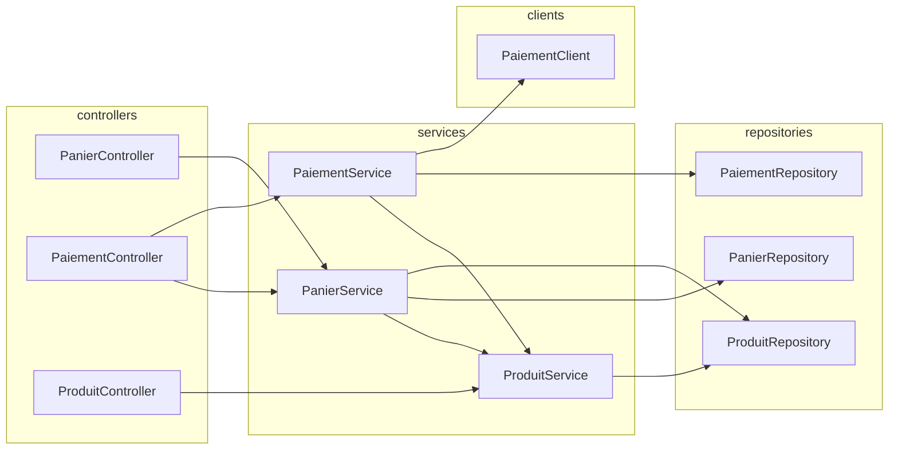
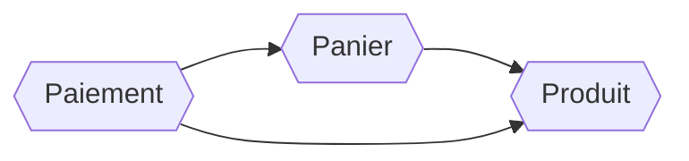

Au fil des mois, des années, des évolutions et des correctifs, le code des projets informatiques a tendance à devenir confus et complexes. Même avec beaucoup de bonne volonté, l'[entropie](https://fr.wikipedia.org/wiki/Entropie_(thermodynamique)) augmente inéluctablement.

Pour limiter cet effet, je vous propose d'organiser votre code pour une meilleure compréhension et éviter cet effet « plat de spagghetti » des dépendances entre les classes du projet.

## Retour à l'essentiel

Dans beaucoup de projets que j'ai rencontrés, les classes sont organisées par rôle technique :

- controllers
- services
- repositories
- model métier
- utilitaires

Et si on rangeait plutôt nos classes dans des grosses boîtes par domaine métier ? On identifie ainsi dans les grandes lignes les dépendances entre domaines en cachant les détails techniques. C'est une approche similaire à l'architecture micro-services, mais au sein d'une application.

Qu'il s'agisse d'un nouveau projet ou du refactor d'un projet existant, il faut identifier les grands domaines métiers.

L'écriture du code n'est que la traduction technique de conceptes métiers parfaitement identifiés lors de la conception. C'est le langage commun que doivent avoir tous les acteurs du projet, la lecture n'en sera que facilitée. 

Quelques exemples de domaines que l'on pourrait identifier : panier, paiement, utilisateur, wishlist, produits…

Dégager des domaines métiers dans le cas de projets « monolithiques » peut-être assez facile, mais devient plus difficile dans le cas de micro-services si la granularité de division des micro-services par domaine métier a déjà été faite finement. Dans un souci de facilité de maintenance, on peut vouloir fusionner des micro-services beaucoup trop petits par exemple !

## Architecture hexagonale

L'architecture hexagonale est un pattern d'architecture comme il en existe d'autres comme la [clean architecture](https://medium.com/@abderrahmane.roumane.ext/les-fondements-de-la-clean-architecture-une-voie-vers-un-code-durable-1542f91f9d0a) qui est aussi une architecture en « couches ». Une fois les domaines métiers identifiés, nous allons nous interessé à l'intérieur de notre composant.

blah blah

